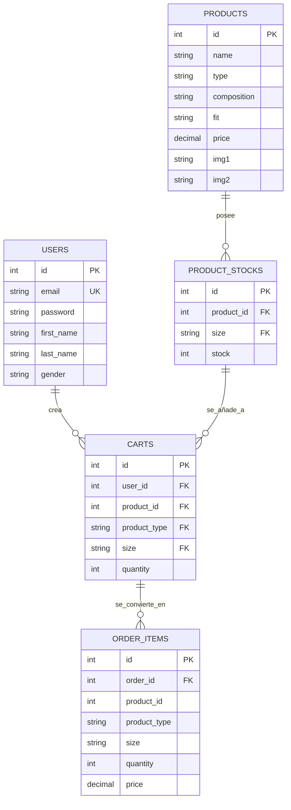

# 🛒 Plataforma E-Commerce - 2º DAW

Este es el repositorio oficial de la web de e-commerce especializada en ropa urbana **_(SkyUrban)_**. La aplicación está construida siguiendo una arquitectura desacoplada moderna utilizando **_Laravel 11/12_** como backend robusto y **_Vue 3_** (Inertia.js) en el entorno cliente.

## 🏗️ 1. Arquitectura y Componentes del Sistema

El proyecto sigue el patrón de diseño **_MVC (Modelo-Vista-Controlador)_** adaptado al ecosistema de Inertia.js, eliminando la necesidad de construir una API con rutas tradicionales para el renderizado, manteniendo la reactividad de una SPA (Single Page Application).

- **Backend (Servidor)**: Laravel 12.3.0, PHP 8.2.12. Se encarga de la lógica de negocio, persistencia de datos, seguridad perimetral y autenticación.
- **Frontend (Cliente):** Vue 3 utilizando la Composition API y JavaScript. Gestiona la reactividad, los estados globales y los eventos mediante window.emitter.
- **Capa de Enlace:** Inertia.js actúa como puente de datos, permitiendo enviar datos directos desde los controladores de Laravel hacia las propiedades (Props) de Vue sin necesidad de construir endpoints Axios manuales en las operaciones principales.
- **Base de Datos:** Relacional (MySQL). Estructura gestionada mediante migraciones de Laravel.

## 🛠️ 2. Guía de Instalación y Despliegue Local

Sigue estos pasos detallados para replicar y arrancar el entorno de desarrollo desde cero sin intervención previa:

### Requisitos Previos

    PHP ≥ 8.2

    Composer v2

    Node.js ≥ 18 & NPM

    Servidor MySQL (XAMPP)

### Pasos de Configuración

1. Clonar el repositorio y acceder al directorio:

```bash
git clone https://github.com/Dameris/final\_proyect\_api.git
```

```bash
cd final_proyect_api
```

2. Instalar dependencias del backend (PHP):

```bash
composer install
```

3. Instalar dependencias del frontend (JavaScript):

```bash
npm install
```

4. Configurar las variables de entorno:
   Copia el archivo de ejemplo a tu archivo definitivo:

```bash
cp .env.example .env
```

Abre el archivo .env recién creado y configura las credenciales de tu base de datos local:

```properties
DB_CONNECTION=mysql
DB_HOST=127.0.0.1
DB_PORT=3306
DB_DATABASE=skyurban_db
DB_USERNAME=root
DB_PASSWORD=
```

5. Generar la clave única de la aplicación:

```bash
php artisan key:generate
```

6. Ejecutar migraciones y poblado de datos (Seeders):

```bash
php artisan migrate:fresh --seed
```

7. Crear el enlace simbólico para el almacenamiento de imágenes:

```bash
php artisan storage:link
```

8. Arrancar los servidores de desarrollo:
   En una terminal ejecuta el servidor de Laravel:

```bash
php artisan serve
```

En otra terminal paralela, ejecuta el compilador en tiempo real de Vite para Vue:

```bash
npm run dev
```

Accede a la plataforma mediante: http://127.0.0.1:8000

## 🧬 3. Flujo de Trabajo en Git y Gitflow Coherente

Para garantizar el orden del proyecto y cumplir con las directrices de desarrollo ágil, se utiliza un sistema estricto de ramas y nomenclatura de mensajes:

### Ramas Principales

- _***main:***_ Contiene el código de producción completamente estable y testeado.
- _***develop:***_ Rama de integración donde se vuelcan las características terminadas.
- _***feature/:***_ Prefijo para el desarrollo de nuevas funcionalidades (Ej: **_feature/dark-mode_**).
- _***bugfix/:***_ Prefijo para la resolución de errores detectados (Ej: **_bugfix/stock-validation_**).

### Nomenclatura de Commits (Semantic Commits)

Los commits deben seguir la estructura estándar corporativa: **_[tipo]: [descripción en presente]_**

- _***feat:***_ Nueva característica
- _***fix:***_ Solución de un error
- _***docs:***_ Cambios en la documentación
- _***style:***_ Estilos CSS, paddings, maquetación

## 🔒 4. Seguridad, Roles y Middleware Real

La seguridad del sistema está estructurada en dos capas infranqueables que no dependen exclusivamente de la interfaz visual del cliente:

1.  **Middleware de Rutas (Kernel/Bootstrap):** Almacenado como alias perimetral en `bootstrap/app.php`. Bloquea peticiones directas HTTP a endpoints administrativos si la sesión activa no posee el rol requerido (`role:admin`).

2.  **Policies de Laravel (Lógica de Dominio):** El modelo `Product` se encuentra blindado mediante `ProductPolicy.php`. Métodos específicos como `update` y `delete` evalúan mediante métodos de Spatie (`$user->hasPermissionTo()`) los privilegios del usuario autenticado, retornando excepciones HTTP `403 Forbidden` en ataques de suplantación de identidad.

## 🌐 5. Documentación de la API y Endpoints Públicos

La plataforma interactúa mediante peticiones REST asíncronas para flujos operativos críticos. A continuación se detallan los endpoints disponibles controlados:

| Método HTTP | Endpoint          | Descripción                                                                                  | Requiere Auth | Códigos de Estado                          |
| ----------- | ----------------- | -------------------------------------------------------------------------------------------- | ------------- | ------------------------------------------ |
| GET         | /api/cart         | Obtiene los elementos del carrito del usuario activo indexando relaciones de stock.          | Sí            | 200 OK, 401 Unauthorized                   |
| POST        | /cart/{type}/{id} | Añade un producto específico (tshirt/jogger) especificando la talla seleccionada.            | Sí            | 200 OK, 400 Bad Request, 404 Not Found     |
| PUT         | /cart/{id}        | Actualiza las unidades deseadas verificando límites de stock relacionales de forma reactiva. | Sí            | 200 OK, 400 Bad Request, 422 Unprocessable |
| DELETE      | /cart/{id}        | Remueve una línea de artículo específica dentro de la cesta de la compra.                    | Sí            | 200 OK, 404 Not Found                      |
| POST        | /checkout         | Procesa la orden de compra mandando los datos del carrito e inyectando los datos de envío.   | Sí            | 201 Created, 422 Unprocessable Entity      |
| GET         | /api/tshirt/{id}  | Devuelve los metadatos y stocks en formato JSON de una camiseta en específico.               | No            | 200 OK, 404 Not Found                      |

### Verificación de Endpoints Públicos mediante `curl`

- **Prueba de catálogo (Obtener metadatos de producto):**

```bash
curl -i -X GET https://skyurban.space/api/tshirt/1
```

Respuesta esperada: `HTTP/1.1 200 OK` junto con el JSON de características del producto.

- **Prueba de protección de seguridad (Acceso denegado al carrito sin login):**

```bash
curl -i -X GET https://skyurban.space/api/cart
```

Respuesta esperada: `HTTP/1.1 401 Unauthorized` o redirección segura, demostrando que el middleware perimetral funciona fuera del entorno de cliente.

### Ejemplo de Payload (Request) - `POST /checkout`

```json
{

    "cart": \[

        {

            "id": 14,

            "size": "M",

            "quantity": 2,

            "product": { "id": 1, "tshirt_name": "Oversized Black" }

        }

    \],

    "shipping_details": {

        "fullName": "Daniel Merino",

        "address": "Calle Barbate",

        "city": "Cádiz",

        "zipCode": "11012",

        "phone": "+34625614329"

    }

}
```

## 🚀 6. Pipeline de Integración Continua (CI/CD)

La plataforma implementa un flujo automatizado de nivel profesional de **Integración Continua (CI)** y **Despliegue Continuo (CD)** gestionado de forma íntegra a través de **GitHub Actions** (`.github/workflows/ci-cd.yml`). El flujo se divide en dos fases críticas encadenadas:

### Fase 1: Integración Continua (CI) - Control de Calidad

Cada vez que se efectúa un `push` a la rama `main`, un runner virtual aislado (`ubuntu-latest`) inicializa un entorno de pruebas idéntico al de producción:

1. **Entorno PHP & Node:** Configura PHP 8.2 e instala las dependencias mediante Composer de forma limpia. Paralelamente, levanta Node.js 18 para la descarga de paquetes NPM.

2. **Base de Datos en Aislamiento:** Instala un contenedor de servicios en segundo plano con MySQL 8.0, inyecta dinámicamente un esquema limpio y ejecuta el juego de migraciones (`php artisan migrate --force`) para asegurar la reproducibilidad de la estructura relacional.

3. **Compilación de Assets:** Procesa y compila el frontend reactivo (`npm run build`) para interceptar fallos de sintaxis en las vistas o propiedades compartidas de Vue 3 e Inertia.js.

### Fase 2: Despliegue Continuo (CD) - Publicación en Caliente

Una vez la Fase 1 concluye con éxito, se dispara de manera automatizada el job de despliegue mediante una conexión segura **SSH tunelizada**:

1. **Autenticación mediante Secretos Encriptados:** El flujo utiliza variables de entorno seguras inyectadas en el repositorio (`HOSTINGER_HOST`, `HOSTINGER_USER`, `HOSTINGER_SSH_KEY`, `HOSTINGER_PORT`) evitando exponer credenciales en el código fuente.

2. **Sincronización Git Remota:** Accede al directorio raíz del servidor web remoto (`public_html`) en Hostinger y ejecuta de forma asíncrona un comando `git pull origin main`.

3. **Optimización de Producción:** El pipeline ejecuta los comandos de optimización del framework en el servidor web:
   - `composer install --no-dev --optimize-autoloader` (Optimiza el mapa de clases de PHP).
   - `npm run build` (Genera los nuevos bundles de producción minimizados para el cliente).
   - `php artisan migrate --force` (Impacta alteraciones de base de datos en caliente).
   - `php artisan config:cache` y `php artisan route:cache` (Sella las configuraciones en memoria de producción para maximizar la velocidad de respuesta HTTP).

Este sistema elimina los errores humanos del despliegue manual por FTP y garantiza que los cambios validados localmente se reflejen en tiempo real en la URL pública sin cortes de servicio.

## 🌐 7. Infraestructura y Servidores de Producción (Hostinger)

El entorno de producción está alojado en la infraestructura de **_Hostinger_**, optimizado para trabajar en sincronía con el pipeline automatizado de GitHub Actions.

### Configuración del Servidor Web y Aplicaciones

- **Servidor Web:** Apache 2.4.x (Gestionado mediante el archivo de directivas de enrutamiento seguro `.htaccess` en la raíz del proyecto).

```apache
<IfModule mod_rewrite.c>

    RewriteEngine On

    RewriteRule ^(.\*)$ public/$1 \[L\]

</IfModule>
```

- **Servidor de Aplicaciones:** PHP-FPM 8.2 (Motor de ejecución en producción).
- **Base de Datos:** MySQL 8.0 (Instancia relacional dedicada con persistencia indexada).
- **Dominio y Acceso Público:** `https://skyurban.space` bajo protocolo seguro SSL/TLS (Puerto 443).
- **Acceso Remoto de Despliegue:** Puerto personalizado SSH `65002` con autenticación por clave asimétrica RSA/ED25519.

> 📝 **Justificación sobre la omisión de Docker en Producción:** He optado por un despliegue nativo sobre servidor Apache/PHP-FPM en Hostinger debido a limitaciones de la infraestructura. Para garantizar la reproducibilidad completa, toda la automatización y control de dependencias he delegado en el pipeline de Integración Continua en runners aislados de GitHub.

## ❓ 8. FAQ de Errores Comunes y Soluciones

- **Error:** `Target class \[role\] does not exist.`
- - **Solución:** Ocurre al no registrar el alias de Spatie. Se resuelve encadenando el método `$middleware->alias(\['role' => ...\])` en el archivo interno `bootstrap/app.php`.
- **Error:** Los contadores del carrito aumentan el stock fantasma.
- - **Solución:** La función `getMaxStock` en el cliente ha sido corregida para consultar de manera pura la respuesta de los almacenes (`stocks.stock`) descartando acumulaciones redundantes del estado local.

## 📊 9. Modelo de Datos y Diagrama Entidad-Relación (ER)

Para la persistencia del sistema e-commerce he diseñado una base de datos relacional con integridad referencial estricta.



### Descripción de Componentes Clave:

- **_users:_** Almacena las credenciales hash (`bcrypt`) y asignación relacional de roles.
- **_products:_** Catálogo maestro indexado por categorías.
- **_product_stocks:_** Tabla pivote relacional que controla de forma estricta las existencias cruzadas por **Tallas (XS, S, M, L, XL, XXL)**, evitando la sobreventa en pasarela de pago.
- **_carts / order_items:_** Persistencia de sesiones de compra asociadas inequívocamente al `user_id` del cliente autenticado.
